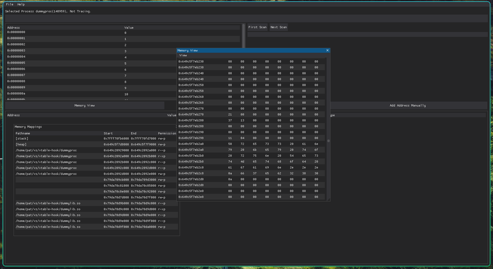

# Pat's Analysis Tools

A work in progress...



### I am using Arch with Hyprland, all other distros and configurations remain untested.

If you run the tool without `sudo` permissions, it will attempt to elevate itself using <u>Polkit</u>.

### Dependencies

`dearpygui` is currently the only required library.

I manage my dependencies using a virtual environment, titled `virtualenv`. I recommend you do the same:

```
python -m venv virtualenv
source virtualenv/bin/activate
pip install dearpygui
```

Read more here: https://docs.python.org/3/library/venv.html

If you wish to install packages outside of a virtual enviroment you may need to change the python executable path in `main.py` from `virtualenv/bin/python` to the path of your python installation.

### Wayland

Wayland does not support running graphical apps with `sudo`, instead XWayland is used. XWayland does not set an XAuthority file, meaning access to the xorg server is restricted to the user. You can allow the `root` user to connect to XWayland with: 

```
xhost si:localuser:root
```

You can remove access with
```
xhost -si:localuser:root
```